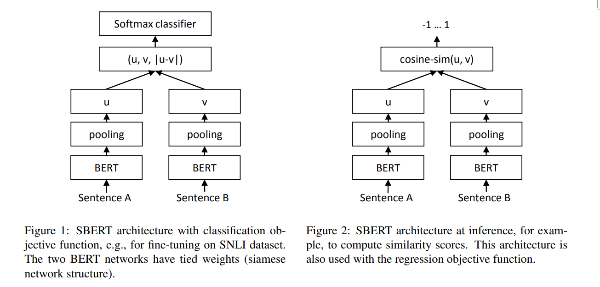
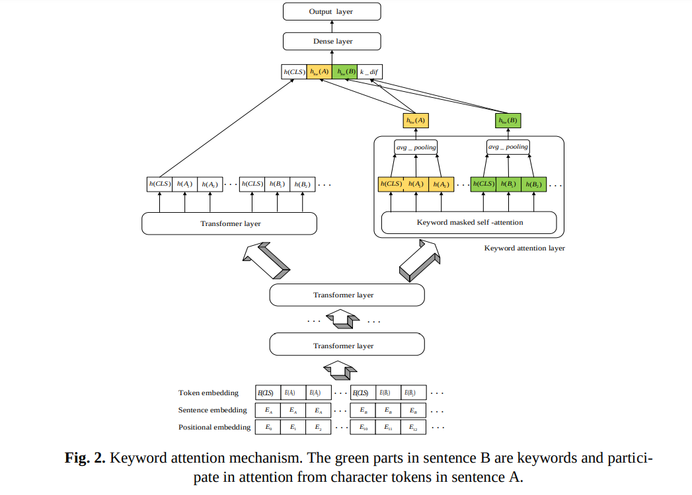
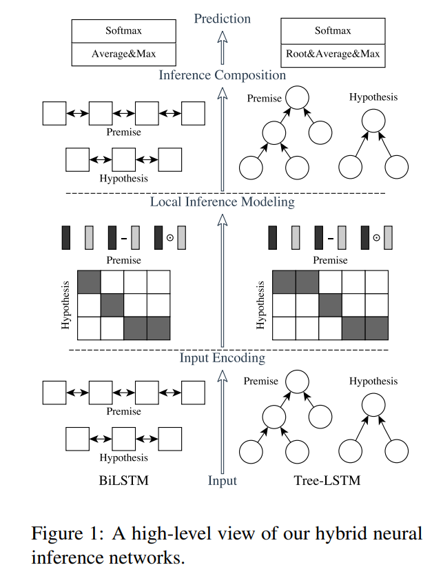

## 文本匹配
[toc]

#### [201908 Sentence-BERT: Sentence Embeddings using Siamese BERT-Networks](../resources/notes/d0001/pretrain_2019_sentence_bert.md)
- https://arxiv.org/pdf/1908.10084.pdf
- https：//github.com/UKPLab/sentence-transformers

- 尝试了三种池化策略：使用CLS令牌的输出，计算所有输出向量的均值（MEAN -strategy），以及计算输出向量的最大时间（MAX -strategy）。默认配置为MEAN
- 三种目标函数
  - Classification Objective Function
  - Regression Objective Function
  - Triplet Objective Function

#### [2019 Keyword-Attentive Deep Semantic Matching](../resources/notes/d0001/pretrain_2019_keyword_attentive_deep_semantic_matching.md)
- [pdf](https://raw.githubusercontent.com/DataTerminatorX/Keyword-BERT/master/Keyword-Attentive_Deep_Semantic_Matching.pdf)
- https://github.com/DataTerminatorX/Keyword-BERT

模型
  - Keyword-attentive BERT：显式告诉模型哪些Token比较重要
  - 负采样：通过关键词的overlapping分数进行负样本是筛选，另外使用实体替换来获得更多的负样本变体（“China”->“America”）
  - 基于领域信息进行关键词抽取
    - 构建关键词注意力语义匹配模型
    - 提高QA查询的检索质量
    - 用于负样本构建

---
#### [201908 ACL RE2: Simple and Effective Text Matching with Richer Alignment Features](../resources/notes/d0001/match201908_ACL_RE2__Simple_and_Effective_Text_Matching_with_Richer_Alignment_Features.md)
- https://arxiv.org/abs/1908.00300

---
#### [201905 FAQ Retrieval using Query-Question Similarity and BERT-Based Query-Answer Relevance](../resources/notes/d0001/match_201905_ACL_FAQ_Retrieval_using_Query_Question_Similarity_and_BERT_Based_Query_Answer_Relevance.md)
- https://arxiv.org/pdf/1905.02851v1.pdf

- 由于模型中使用了QA相关性匹配，因此如果Qq从词法上相差太大，也能进行匹配
- 取10个BERT返回的最大相关性的答案
- 对于TSUBAKI score
  - 如果大于α，则直接按照该分数排序
  - 否则则采用合并分数排序 tsubaki + bert
  - 由于TSUBAKI利于长文本，因此需要对长度进行惩罚，除以
  
  k1 = 4, k2 = 2,  α = 0.3

---
#### [201904 Understanding the Behaviors of BERT in Ranking](../resources/notes/d0001/match_201904_Understanding_the_Behaviors_of_BERT_in_Ranking.md)
- [1904.07531](https://arxiv.org/pdf/1904.07531.pdf)
- 使用BERT的[CLS]分量进行预测效果最好
- 两个数据集
  - MS MARCO, 环境上下文很重要，BERT表现比较好
  - TREC，用户的点击行为更重要，Conv-KNRM（bing）更好 

---
#### [201804 SAN - Stochastic Answer Networks for Natural Language Inference](../resources/notes/d0001/match_201804_Stochastic_Answer_Networks_for_Natural_Language_Inference.md)
- https://arxiv.org/pdf/1804.07888.pdf

---
#### [201609 ESIM Enhanced LSTM for Natural Language Inference](../resources/notes/d0001/match_2016_Enhanced_LSTM_for_Natural_Language_Inference.md)
- https://arxiv.org/abs/1609.06038

- input encoding:
  - 使用BiLSTM对输入序列（前提和假设）进行编码，也可以使用Tree LSTM
- local inference modeling
  - 使用注意力机制来软对齐前提与假设之间的词语
  - 基于相似性矩阵计算注意力并基于注意力计算每个词语的软对齐词语
  - 进一步的增强，计算差值以及点积
- inference composition
  - 使用BiLSTM层来对上层的输入分别进行信息的组合
  - 为了控制复杂性，可以使用一个单层RELU的前馈神经网络对输入进行降维
  - 使用平均与最大pooling将变长的序列输入变成固定长度向
  - 分类器进行分类

---
#### [2013 DSSM Learning Deep Structured Semantic Models for Web Search using Clickthrough Data](../resources/notes/d0001/match_2013_Learning_Deep_Structured_Semantic_Models_for_Web_Search_using_Clickthrough_Data.md)
- http://xueshu.baidu.com/usercenter/paper/show?paperid=2568ab8f33304dae23b50a8b17052124&site=xueshu_se

- 词HASH   good -》#good#-》#go, goo, ood, od#
- DNN训练模型向量
- 余弦相似度计算query与文档的相关性

--- 
#### [201702 Bilateral Multi-Perspective Matching for Natural Language Sentences](../resources/notes/d0001/match_201702_Bilateral_Multi_Perspective_Matching_for_Natural_Language_Sentences.md)
- https://arxiv.org/abs/1702.03814

#### [201606 A Decomposable Attention Model for Natural Language Inference](../resources/notes/d0001/match_201606_A_Decomposable_Attention_Model_for_Natural_Language_Inference.md)
- https://arxiv.org/abs/1606.01933v2

#### [201503 Convolutional Neural Network Architectures for Matching Natural Language Sentences]()
- https://arxiv.org/abs/1503.03244

