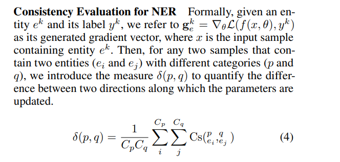

# 语法分析
[toc]

---
### Struct Label

##### [202001 Do we need word order information for cross-lingual sequence labeling]

##### [201908 - LAN - Hierarchically-Refined Label Attention Network for Sequence Labeling](../resources/notes/d0001/structlabel_201908_Hierarchically_Refined_Label_Attention_Network_for_Sequence_Labeling.md)
论文链接: https://arxiv.org/abs/1908.08676
源码链接: https://github.com/Nealcly/BiLSTM-LAN

---
### Word Segment
##### [2019ACL Is Word Segmentation Necessary for Deep Learning of Chinese Representations?](../resources/notes/d0001/nlplac_2019_is_word_segmentation_necessary_for_deep_learning_of_chinese_representations.md)
- https://www.aclweb.org/anthology/P19-1314.pdf

- 基于字符的模型始终优于基于词的模型
- 基于词的模型的劣势归因于词分布的稀疏性，导致更多的OOV单词和过拟合的问题

##### [Long Short-Term Memory Neural Networks for Chinese Word Segmentation]
- https://www.aclweb.org/anthology/D15-1141/

---
### Named Entity Recognition

##### [202002 Rethinking Generalization of Neural Models: A Named Entity Recognition Case Study](../resources/notes/d0001/ner_202002_Rethinking_Generalization_of_Neural_Models.md)
- http://pfliu.com/InterpretNER/rethink-ner.pdf
- http://pfliu.com/InterpretNER/interpretNER.html
- 项目主页：https://github.com/pfliu-nlp/Named-Entity-Recognition-NER-Papers

entity coverage ratio (ECR)  实体覆盖率
: 

Expectation of Entity Coverage Ratio (EECR)
: 
所有测试集中的实体在训练集中出现的期望

Contextual Coverage Ratio (CCR)
: 训练集和测试集中同类实体的上下文相似度

Consistency Evaluation for NER
: 
通过测试样本的梯度相似性来统计两个类别的相似性

##### [202002 Zero-Resource Cross-Domain Named Entity Recognition](../resources/notes/d0001/ner_202002_Zero_Resource_Cross_Domain_Named_Entity_Recognition.md)
- https://arxiv.org/abs/2002.05923

我们使用一个任务来判断一个单词是否是实体，见图中的Task1，训练集中非标注实体为单一类别，其他归为一个类别，也即是二分类
原始的NER，如图中的task2，预测实际的类别

CRF1 and CRF2 分别表示 Task1 and Task2 的CRF 层
expert gate 由线性层+softmax组成，我们使用task2的进行监督训练

##### [202001 CLUENER2020: FINE-GRAINED NAMED ENTITY  RECOGNITION DATASET AND BENCHMARK FOR CHINESE](../resources/notes/d0001/ner_202001_clue_ner_2020.md)
- 

##### [201812 A Survey on Deep Learning for Named Entity Recognition](../resources/notes/d0001/ner_201812_A_Survey_Named_Entity_Recognition.md)
- https://arxiv.org/abs/1812.09449

##### [Neural adaptationlayers for cross-domain named entity recognition]

##### [2017 Semi-supervised sequence tagging with bidirectional language models]

##### [Transfer learning for sequence tagging with hierarchical recurrent networks]

##### [Crossdomain ner using cross-domain language modeling]

--- 
### Coreference Resolution
##### [2017 ACL End-to-end Neural Coreference Resolution]
- https://www.aclweb.org/anthology/D17-1018.pdf

---
### Semantic Role Labeling
##### [2017 ACL Deep Semantic Role Labeling: What Works and What's Next]()

---
### Dependency Parser
Dependency paths identify semantic
relations – e.g., for protein interaction
[Erkan et al. EMNLP 07, Fundel et al. 2007, etc.]

Danqi Chen, and Christopher D. Manning. "A Fast and Accurate
Dependency Parser using Neural Networks." EMNLP. 2014.
Kuebler, Sandra, Ryan McDonald, and Joakim Nivre. “Dependency parsing.” Synthesis Lectures on Human Language Technologies 1.1 (2009): 1-127.

A neural dependency parser
[Chen and Manning 2014]

Greedy choice of attachments guided by good machine learning classifiers
MaltParser (Nivre et al. 2008)

Leading to SyntaxNet and the Parsey McParseFace model
https://research.googleblog.com/2016/05/announcing-syntaxnet-worlds-most.html

[Universal Dependencies: http://universaldependencies.org/ ;
cf. Marcus et al. 1993, The Penn Treebank, Computational Linguistics]

A Neural graph-based dependency parser
[Dozat and Manning 2017; Dozat, Qi, and Manning 2017]
