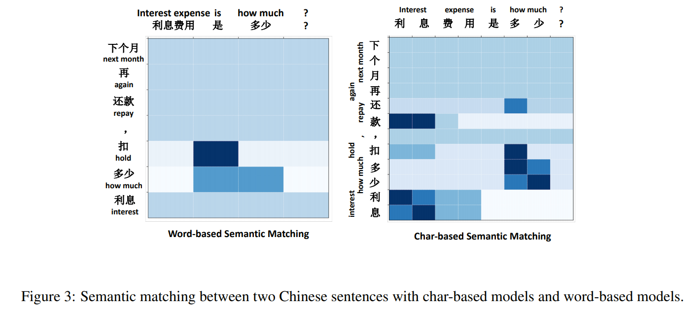

# 语法分析
[toc]

## Struct Label

##### [201908 - LAN - Hierarchically-Refined Label Attention Network for Sequence Labeling](../resources/notes/d0001/structlabel_201908_Hierarchically_Refined_Label_Attention_Network_for_Sequence_Labeling.md)
论文链接: https://arxiv.org/abs/1908.08676
源码链接: https://github.com/Nealcly/BiLSTM-LAN

## Word Segment
##### [2019ACL Is Word Segmentation Necessary for Deep Learning of Chinese Representations?](../resources/notes/d0001/nlplac_2019_is_word_segmentation_necessary_for_deep_learning_of_chinese_representations.md)
- https://www.aclweb.org/anthology/P19-1314.pdf

- 基于字符的模型始终优于基于词的模型
- 基于词的模型的劣势归因于词分布的稀疏性，导致更多的OOV单词和过拟合的问题

## Named Entity Recognition
##### [2017 Semi-supervised sequence tagging with bidirectional language models]

## Coreference Resolution
##### [2017 ACL End-to-end Neural Coreference Resolution]
- https://www.aclweb.org/anthology/D17-1018.pdf

## Semantic Role Labeling
##### [2017 ACL Deep Semantic Role Labeling: What Works and What's Next]()

## Word Segment
- [Long Short-Term Memory Neural Networks for Chinese Word Segmentation](https://www.aclweb.org/anthology/D15-1141/)

## Dependency Parser
Dependency paths identify semantic
relations – e.g., for protein interaction
[Erkan et al. EMNLP 07, Fundel et al. 2007, etc.]

Danqi Chen, and Christopher D. Manning. "A Fast and Accurate
Dependency Parser using Neural Networks." EMNLP. 2014.
Kuebler, Sandra, Ryan McDonald, and Joakim Nivre. “Dependency parsing.” Synthesis Lectures on Human Language Technologies 1.1 (2009): 1-127.

A neural dependency parser
[Chen and Manning 2014]

Greedy choice of attachments guided by good machine learning classifiers
MaltParser (Nivre et al. 2008)

Leading to SyntaxNet and the Parsey McParseFace model
https://research.googleblog.com/2016/05/announcing-syntaxnet-worlds-most.html

[Universal Dependencies: http://universaldependencies.org/ ;
cf. Marcus et al. 1993, The Penn Treebank, Computational Linguistics]

A Neural graph-based dependency parser
[Dozat and Manning 2017; Dozat, Qi, and Manning 2017]
