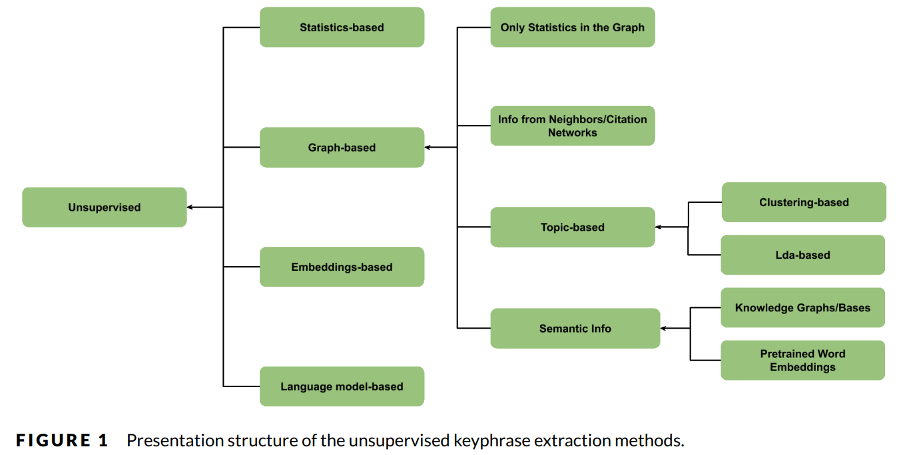
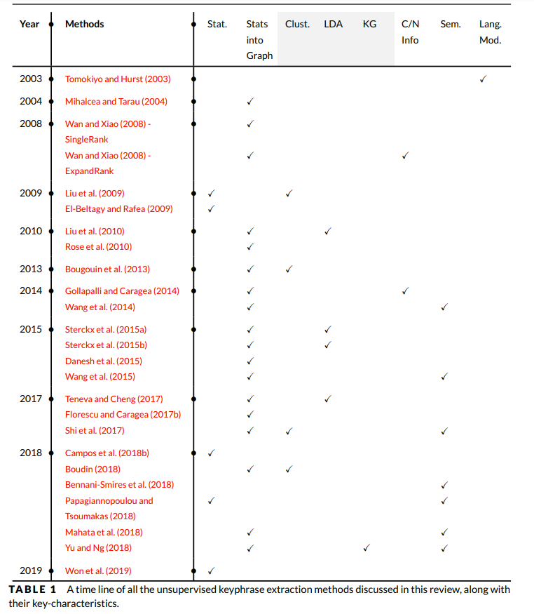

# A Review of Keyphrase Extraction

[toc]

https://arxiv.org/pdf/1905.05044.pdf

## 1. 介绍
- Unsupervised methods
    - domain independent
    - do not need labeled training data
- Supervised methods
    - powerful modeling capabilities
    - higher accuracy
- 用法
    - 语义检索
        - 完全替代全文检索
        - 文档检索 + 关键词组附加效果
    - 问句扩展
    - 文档聚类与分类
    - 指导文档摘要
    - 学术出版中： 任务、技术、趋势等
- Hasan and Ng (2014)
    - 错误评价： 可替代词语，算错误
    - 冗余错误
    - 稀少错误： 出现次数较少的短语不容易检测出来
    - 基于包含频繁词语的词语有可能过于泛化输出： 可能部分短语是不合适的
- (Hasan and Ng, 2010)
    - 应该在多个数据集上评测
    - tfidf是个不错的基线系统
## 2. 非监督方法
- 步骤
    1. Selection of the candidate lexical units based on some heuristics. Examples of such heuristics are the exclusion of stopwords and the selection of words that belong to a specific part-of-speech (POS).
    2. Ranking of the candidate lexical units.
    3. Formation of the keyphrases by selecting words from the top-ranked ones or by selecting a phrase with a high rank score or whose parts have a high score.

### Statistics-based Methods
#### tf-idf: $tf*\log_2\frac{N}{1+|d\in D:phrase\in d|}$
#### 变种 mean × Tf
- logarithm of the phrase frequency, 饱和高频率词语
- mean × Tf， mean of the words’ scores which constitute the phrase
#### KP-Miner (El-Beltagy and Rafea, 2009)
- candidates those that are not be separated by punctuation marks/stopwords
- least allowable seen frequency (lasf) factor
- cutoff constant (CutOff) that is defined in terms of a number of words after which a phrase appears for the first time
- the system ranks the candidate phrases taking into account the Tf and Idf scores as well as the term position and a boosting factor for compound terms over the single terms
#### KeyCluster (Liu et al., 2009)
- 去停止词，选择被选词组
- co-occurrence-based or Wikipedia-based 计算语义相关度，进行聚类
- 基于单个类别进行词组选择

#### YAKE (Campos et al., 2018b)
- 使用上下文信息以及词语覆盖范围
- 分离term，并计算特征， 越小越重要
    - Casing (Wcase that reflects the casing aspect of a word)
    - Word Positional (WPosition that values more those words occurring at the beginning of a document)
    - Word Frequency (WFreq)
    - Word Relatedness to Context(WRel that computes the number of different terms that occur to the left/right side of the candidate word)
    - Word DifSentence (WDifSentence quantifies how often a candidate word appears within different sentences)

- 1, 2 and 3-gram candidate keywords, 越小越有意义

#### Won et al. (2019)
- 使用简单文本特征达到可匹敌STOA
- 步骤
    - 使用形态句法模板候选短语
    - 计算特征
        - Term Frequency, i.e., the sum of each word frequency of the candidate phrase
        - Inverse Document Frequency (Idf)
        - Relative First Occurrence, i.e., the cumulative probability of the type $(1 − a)^k$ where a ∈ [0, 1] measures the position of the first occurrence and k the candidate frequency
        - Length, i.e., a simple rule that scores 1 for unigrams and 2 for the remaining size
        - 结果进行求积
    - 短语个数
        - n = 2.5 × log10(doc size)， 实验而来

### Graph-based Ranking Methods

### Keyphrase Extraction based on Embeddings

### Language Model-based Methods