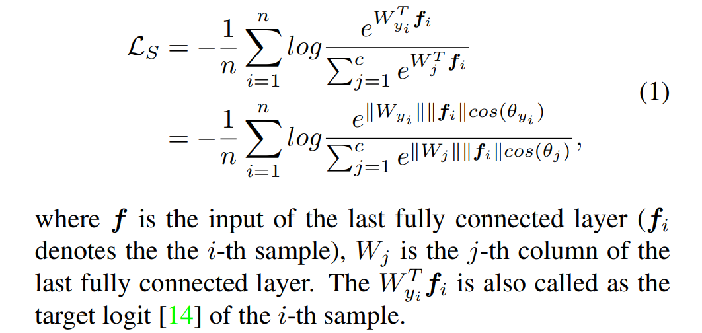

# AMSoftmax: Additive Margin Softmax for Face Verification
[toc]

- https://arxiv.org/pdf/1801.05599.pdf

### Abstract
- 提出了一个概念简单且几何上可解释的目标函数，即AM-Softmax loss，用于深度人脸验证
- 人脸验证任务可以看作是一个度量学习问题，因此学习较大间隔的人脸特征，其类内差异小，类间差异大，对于获得良好的性能具有重要意义
- 讨论了特征归一化的优点

### 1. Introduction
- 大多数人脸验证模型均是建立在深卷积神经网络的基础上，并由分类损失函数[18、20、19、9]、度量学习损失函数[16]或两者共同监督[17、13]。contrastive loss[17]或triplet loss[16]等度量学习损失函数通常需要精心设计样本挖掘策略，而最终的性能对这些策略非常敏感，因此越来越多的研究者将注意力转移到基于改进的分类损失函数来构建人脸验证模型[20，19，9]

- SoftMax loss通常擅长优化类间差异（即分离不同的类），但不擅长减少类内差异（即使同一类的特性紧凑）。为了解决这一问题，提出了许多新的损失函数来最小化类内差异
- 我们提出了一种新的更具解释性的方法，将角度间隔引入到softmax loss中。我们通过cosθ−m制定了一个额外的间隔，它比[9]简单，并且产生更好的性能。从方程（3）可以看出，m乘以[9]中的目标角$θ_{y_i}$ ，所以这种类型的边界以乘法的方式合并。由于我们的间隔是从cosθ减去的一个标量，我们称之为损失函数加性间隔SoftMax（AM-SoftMax）

### 2. Preliminaries
##### Softmax
Softmax为矩阵中真实类的单列与最后层的输入之间的点积

##### A-Softmax

- 提出了归一化权重向量（使||W_i||==1），并将目标的逻辑推理从$cos(θ_{y_i})改为ψ(θyi)$
-  m通常是一个大于1的整数，而λ是一个超参数，用于控制推动分类边界的难易程度
-  训练过程中，将λ从1000退火到一个较小的值，使每个类别的角度间隔变得越来越紧凑。在他们的实验中，他们将λ的最小值设为5，m=4，这近似等于m=1.5

### 3. Additive Margin Softmax
##### 3.1. Definition
$$ψ(θ) = cosθ − m$$
- 定义更加简单和直观。在实现过程中，将特征和权重归一化后的输入实际上是x=cosθyi ，所以在正向传播中，我们只需要计算 x - m
- 不需要计算反向传播的梯度，因为Ψ′(x)=1。与SphereFace相比，它更容易实现
- 由于我们使用cosine作为相似度来比较两个人脸特征，因此我们遵循[19，11，12]将特征归一化和权重归一化同时应用到内积层以构建一个cosine层。然后我们使用超参数s缩放余弦值，如[19，11，12]所示。最后，损失函数变成

- 假设Wi 和f的范数如果没有指定，则归一化为1。在[19]中作者建议通过反向传播来学习缩放因子s。然而，在将间隔引入损失函数后，我们发现如果让我们学习的话，S不会增加而且网络收敛很慢，因此我们将S定为一个足够大的值，例如30，以加速和稳定优化。
- 将特征和权重归一化，不将缩放参数作为超参数进行训练，将其设为固定值比如30

##### 3.2. Discussion

- AM-Softmax 方案在超球面上有清晰的几何解释
- 经过归一化后，特征在一个圆上，传统的Softmax loss 的决策边界表示为向量P0。在这种情况下，在决策边界处有WT1P0=WT2P0
- AM-softmax，边界变成一个边缘区域而不是一个向量
- 
 

