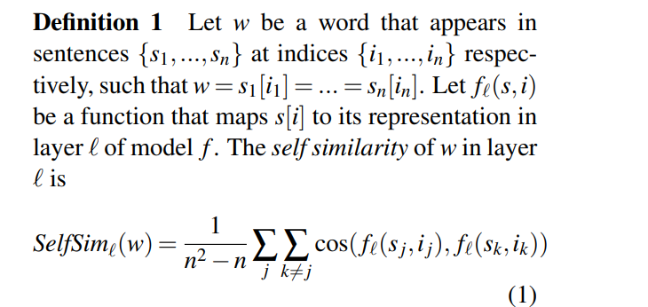

# How Contextual are Contextualized Word Representations? Comparing the Geometry of BERT, ELMo, and GPT-2 Embeddings
[toc]

- https://arxiv.org/abs/1909.00512v1

### Abstract
- 预训练模型得到的表示向量的语境化程度到底有多高，它们只是简单的为每个词在不同的上下文提供一个单独的表示，还是为每个词只分配有限量的表示向量？

### 1 Introduction
- 传统的嵌入是静态的，与上下文无关的
- 基于上下文的嵌入表示（ＥＬＭＯ、ＢＥＲＴ）提升了ＮＬＰ任务的性能
- 到底预训练模型得到的表示向量的语境化程度到底有多高，它们只是简单的为每个词在不同的上下文提供一个单独的表示，还是为每个词只分配有限量的表示向量？
- 结论
  - 在BERT、ELMo和GPT-2的所有层中，所有的词它们在嵌入空间中占据一个狭窄的锥，而不是分布在整个区域
  - 上层比下层产生更多特定于上下文的表示，然而，这些模型对单词的上下文环境非常不同
  - 如果一个单词的上下文化表示根本不是上下文化的，那么我们可以期望100%的差别可以通过静态嵌入来解释。相反，我们发现，平均而言，只有不到5%的差别可以用静态嵌入来解释
  - 我们可以为每个单词创建一种新的静态嵌入类型，方法是将上下文化表示的第一个主成分放在BERT的较低层中。通过这种方式创建的静态嵌入比GloVe和FastText在解决单词类比等基准测试上的表现更好。

### 2 Related Work
- Static Word Embeddings
- Contextualized Word Representations
- Probing Tasks

### 3 Approach
#### 3.1 Contextualizing Models
- ELMo, BERT, and GPT-2

#### 3.2 Data
- SemEval Semantic Textual Similarity tasks from years 2012 - 2016
- same words appear in different contexts
- 不考虑低于５个上下文的词语

#### 3.3 Measures of Contextuality
self-similarity
: 
计算ｌ层中不同句子中相同词语的表示相似度，为１则全一样

intra-sentence similarity
: 
计算一个词语与其上下文之间的相似度，是否简单朴素的与其上下文均值相似

maximum explainable variance
: 

表示给定层中w的上下文表示的方差的比例，而这可以使用它们的第一个主成分解释。当MEV的值越小表示模型语境化能力越强，反之表示模型语境化能力越弱

#### 3.4 Adjusting for Anisotropy
如果一个词语的向量是各向同性，则自相似度95%表示其很少的上下文化
而如果其各向异性，且有99%的相似性，则自相似度95%可能表示其具有较好的上下文能力

### 4 Findings

### 5 Future Work

### 6 Conclusion