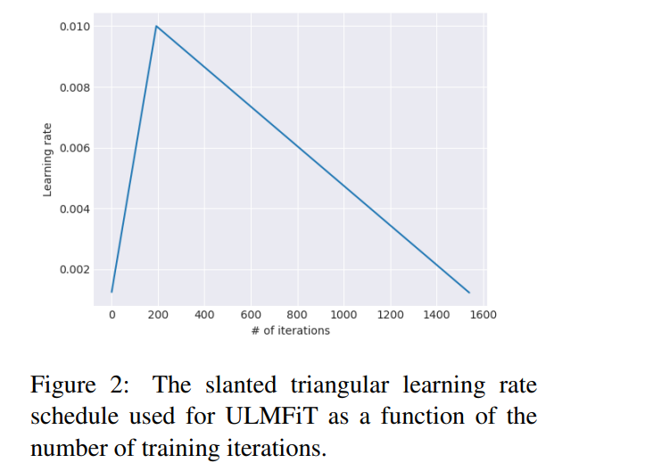

# Universal Language Model Fine-tuning for Text Classification
[toc]

- PAPER: https://arxiv.org/pdf/1801.06146.pdf
- CODE: http://nlp.fast.ai/ulmfit
- [ULMFiT-用于文本分类的通用语言模型微调 - 论文翻译](https://www.jianshu.com/p/0fb6c9886542)

## Abstract
- 提出通用语言模型微调（ULMFiT），一种可以应用NLP中任何任务的迁移学习方法
- 即使只有100个标签示例，它的表现可以和100倍数据从头开始训练的效果相比拟

## 1 Introduction
-归纳迁移学习对计算机视觉（CV）产生了很大的影响关于。 应用CV模型（包括对象检测，分类和语义分割）很少从头开始训练，而是用已有的模型进行微调，如在ImageNet，MS-COCO等数据集上预训练的模型
- 目前自然语言处理中用到迁移学习的，主要是微调预训练的词嵌入，这是一种简单的迁移技术，它只针对模型的第一层，但在对实际效应有着巨大的影响，并运用于各种最好的模型中。最新的方法将来自其他任务的嵌入与不同层次的输入相结合，但仍然从头开始训练主要任务模型，并将预训练嵌入视为固定参数，限制了其有用性
- LM会过拟合于小型数据集并在微调一个分类器的时候遭受灾难性的遗忘。相对于CV而言，NLP模型通常更加浅，因此需要不同的微调方法
- 贡献
    1. 提出通用语言模型微调（ULMFiT），一种可以在任何自然语言处理任务上实现类似CV的转移学习的方法
    2. 提出动态微调，倾斜三角学习率，渐进式解冻，等新的技术来保持过往知识和避免微调中的灾难性遗忘
    3. 六个代表性文本分类的达到了最好的效果，并在大多数数据集上减少了18-24％的误差
    4. 能够实现极其样本有效的迁移学习并进行广泛的消融分析
    5. 制作了预训练模型
    
## 2 Related work
- CV中的迁移学习
    - 通过微调预训练模型的最后一层或几层，并使剩余的层冻结
- Hypercolumns
    - 预训练嵌入，通过其他任务获取额外的上下文信息。 然后将不同级别的嵌入用作特征，与单词嵌入或中间层的输入连接
    - 最近在NLP被彼得斯等人分别使用语言建模，释义，蕴涵和机器翻译（MT）进行预训练
    - 需要设计定制的架构, 在CV中，hypercolumns也几乎已经完全被端到端的微调所取代
- 多任务学习
    - 将语言建模目标添加到与主任务模型联合训练的模型中。 MTL要求每次都从头开始训练任务，这使得效率低下并且通常需要仔细权衡任务特定的目标函数
- 微调

## 3 Universal Language Model Fine-tuning

- 语言建模可以被视为理想的源任务：它捕获了与下游任务相关的语言的许多方面，例如长期依赖，层次关系和情绪。与MT和蕴涵等任务相比，它为大多数域和语言提供接近无限数量的数据。此外，预训练的LM可以很容易地适应目标任务的特性，我们可以显着提高性能。此外，语言建模已经是MT和对话建模等现有任务的关键组成部分。形式上，语言建模引发了一个假设空间H，它应该对许多其他NLP任务有用
- 在我们的实验中，我们使用最先进的语言模型AWD-LSTM（Merity等，2017a），一个常规LSTM（没有注意力，快捷连接或其他复杂的添加），具有各种调谐dropout超参数
- 通用语言模型微调（ULMFiT）
    - 1）它适用于不同文档大小，数量和标签类型的任务; 
    - 2）它使用单一的架构和训练过程; 
    - 3）它不需要自定义特征工程或预处理; 
    - 4）它不需要额外的域内文件或标签

### 3.1 General-domain LM pretraining
- Wikitext-103上的语言模型，该模型包含28,595个预处理的维基百科文章和1.03亿个单词

### 3.2 Target task LM fine-tuning
Discriminative fine-tuning
: 由于不同的层捕获不同类型的信息，它们应该在不同程度上进行微调
$$\theta_t^l = \theta_{t-1}^l - \eta^l * \nabla_{\theta^l}J(\theta)$$
经验发现，首先选择最后一层的学习率$\eta^L$ ，仅微调最后一层, 然后通过使用$\eta^{l-1} = \eta^l / 2.6$ 作为较低层的学习率最有效

Slanted triangular learning rates 倾斜的三角学习率
: 为了使其参数适应任务特定的特征，我们希望模型在训练开始时快速收敛到参数空间的合适区域，然后细化其参数
提出倾斜的三角学习率（STLR），它首先线性地增加学习率，然后根据以下更新时间表线性衰减它

其中T是训练迭代的次数，cut_frac是我们增加LR的迭代的分数，cut是当我们从增加切换到减少LR时的迭代，p是我们增加或将减少的迭代次数的分数, ratio指定最小LR与最大LR ηmax相比小多少，ηt是迭代t时的学习速率。 我们通常使用cut_frac = 0.1，ratio = 32和ηmax= 0.01, 当t == cut, p为1为最大

### 3.3 Target task classifier fine-tuning
- 为了微调分类器，我们使用两个额外的线性块来增强预训练语言模型。 遵循CV分类器的标准实践，每个块使用批量标准化和dropout，中间层使用ReLU激活，在最后一层通过softmax激活输出目标类的概率分布。 请注意，这些特定于任务的分类器层中的参数是从头开始学习的唯一参数。 第一个线性层将合并的最后隐藏层状态作为输入

Concat pooling
: 输入文档可能包含数百个单词，如果我们只考虑模型的最后隐藏状态，信息可能会丢失。 出于这个原因，我们将文档的最后一个步骤hT的隐藏状态与各时间步长的隐藏状态的max-pooled和mean-pooled表示拼接，获得一个gpu显存相对合适的文本表示：H ={$ h_1, …, h_T$}

Gradual unfreezing
: - 微调目标分类器是转移学习方法中最关键的部分。 过于激进的微调将导致灾难性的遗忘，消除通过语言建模捕获的信息的好处; 过于谨慎的微调会导致收敛缓慢（以及由此导致的过度拟合）。 除了差别性微调和三角学习率之外，我们还建议逐步解冻以微调分类器
  - 建议从最后一层开始逐渐解冻模型，而不是一次微调所有层; 我们首先解冻最后一层， 在一个时期内微调所有未冻结的层,  然后我们解冻下一个较低的冻结层并重复，直到我们微调所有层

BPTT for Text Classification (BPT3C)
: 通过时间反向传播（BPTT）训练语言模型，以实现大输入序列的梯度传播。 为了使大型文档的分类器微调可行，我们提出了BPTT for Text Classification（BPT3C）：我们将文档划分为大小为b的固定长度批次。 在每个批次的开头，模型初始化为前一批次的最终状态; 我们跟踪平均值和最大池的隐藏状态; 梯度反向传播到批次，其隐藏状态有助于最终预测。 在实践中，我们使用可变长度反向传播序列

Bidirectional language model
: 不仅限于微调单向语言模型。 对于我们所有的实验，我们预先训练前向和后向LM。 我们使用BPT3C独立微调每个LM的分类器并平均分类器预测

## 4 Experiments
### 4.1 Experimental setup
|Dataset	|Type	|#classes	|#examples|
-|-|-|-
TREC-6|	Question|	6|	5.5k
IMDb|	Sentiment|	2|	25k
Yelp-bi|	Sentiment|	2|	560k
Yelp-full|	Sentiment|	5|	650k
AG|	Topic|	4|	120k
DBpedia|	Topic|	14|	560k

超参数
- 在IMDb验证集上进行调整。 我们使用AWD-LSTM语言模型（Merity等，2017a），嵌入大小为400,3层，每层隐藏激活1150次，BPTT批量大小为70.我们将0.4的dropout应用于最后一层， 0.3应用于RNN层，0.4应用于输入嵌入层，0.05应用于嵌入层，0.5的权重dropout到RNN的hidden-to-hidden矩阵。 分类器有一个大小为50的隐藏层。我们使用Adam的β1= 0.7而不是默认的β1= 0.9和β2= 0.99。 我们使用批量大小为64，基本学习率为0.004和0.01分别对LM和分类器进行微调，并调整每个任务的验证集上的epoch数量。 我们使用和(Merity et al., 2017a)相同的做法

### 4.2 Results

在三类分类任务上，ULMFit的监督学习、半监督学习需要的数据比从头训练模型的数据要少得多，但是错误率却更低，模型的效果更好。
