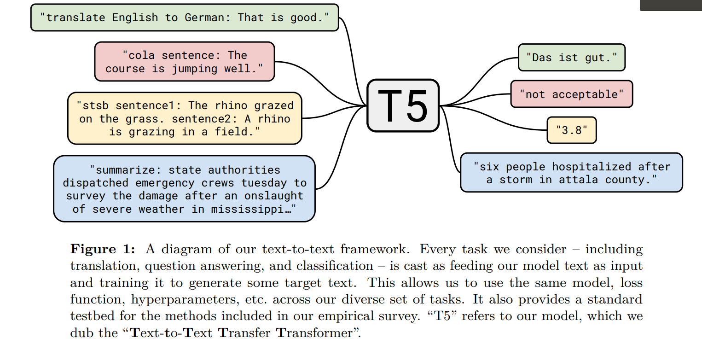

# Exploring the Limits of Transfer Learning with a Unified Text-to-Text Transformer
[toc]
https://arxiv.org/pdf/1910.10683.pdf
https://github.com/google-research/text-to-text-transfer-transformer
## 1 Introduction
- 训练机器学习模型以执行自然语言处理任务通常需要模型能够以适合下游学习的方式处理文本
- 可以将其大致视为发展通用知识，使模型可以“理解”文本。这些知识的范围从低级（例如单词的拼写或含义）到高级（例如大多数背包都无法容纳大号这样大的乐器）
- 这些知识很少通过显式完成，往往作为任务的一部分进行学习，如词语向量表示往往通过如下目标进行学习：共现的词语往往处于空间的相似地方
- 为了获得更严谨的理解，我们提出了一种统一的迁移学习方法，使我们能够系统地研究不同的方法，并推动领域发展
- T5 的基本思想是将每个 NLP 问题都视为“text-to-text”问题，即将文本作为输入并生成新的文本作为输出，这允许将相同的模型、目标、训练步骤和解码过程，直接应用于每个任务

## 2 Setup

### 2.1 Model
- 我们的结构接近原始发表的结构
- Transformer 使用正余弦函数的位置编码，BERT 使用的是学习到的位置嵌入，而本文使用的是相对位置嵌入
- 相对位置嵌入不是对每个位置使用固定的嵌入，而是根据 self-attention 机制中的“key”和“query”之间的偏移量生成不同的学习嵌入。本文使用位置嵌入的简化形式——每个“嵌入”只是一个标量，被添加到用于计算注意力权重的相应 logit 中。为了提高效率还在模型的所有层之间共享位置嵌入参数，不过每个注意力头使用的是不同“套”位置嵌入。通常学习固定长度的嵌入，每个嵌入对应于一系列可能的key-query偏移量。在这项工作中，我们对所有模型使用 32 个嵌入，其数值范围的大小以对数方式增加，最大偏移量为128，超过此偏移量，所有相对位置使用同一嵌入。需要注意的是，某一给定层对超过 128 的相对位置不敏感，但是后续层可以通过组合来自先前层的局部信息来建立对更大偏移的敏感性

### 2.2 The Colossal Clean Crawled Corpus
通过 Common Crawl 抓取网页文本数据，并使用下列启发式方法进行过滤，剩余750G
- 只保留以终点符号（即句点，感叹号，问号或引号）为结尾的行
- 删除任何包含 List-of-Dirty-Naughty-Obscene-and-Otherwise-Bad-Words 中单词的网页
- 删除包含 Javascript 单词的行
- 删除出现“lorem ipsum”短语（即排版测试）的所有页面
- 删除所有包含大括号的页面
- 对数据集进行重复数据删除，当连续的三句话重复出现时只保留一个
- 使用 langdetect 工具过滤掉非英文的页面

### 2.3 Downstream tasks
测试如下任务的性能
- 文本分类：GLUE & SuperGLUE，是测试通用语言理解能力的文本分类任务的集合，包括句子可接受性判断、情绪分析、释义/句子相似度、自然语言推断、指代消解、完成句子、词义消歧和问题回答。
- 机器翻译：WMT English to German, French, and Romanian translation
- 文本摘要：CNN/Daily Mail abstractive summarization
- 智能问答：SQuAD question answering

微调方法：将 GLUE (SuperGLUE也类似) 中所有任务的数据集在微调时连接起来，将所有任务视为一个任务，并且在 SuperGLUE 中加入了 Definite Pronoun Resolution (DPR) 数据集。本模型使用 SQuAD 数据集时是将问题和上下文喂入，并逐个令牌生成答案。机器翻译任务中也仅对英语数据进行预训练，这意味着模型需要学习生成目标语言的文本

### 2.4 Input and output format
- 为了在上述各种任务上训练单个模型，需要在所有任务上保持一致的输入和输出格式。 decaNLP将 10 项不同的任务都写成了 QA 的形式，进行训练与测试，以文本到文本的格式来表达大多数NLP任务，输入上下文或条件文本后输出文本
- 为预训练和微调提供了一致的训练目标。具体来说，无论任务如何，都以极大似然为目标训练模型并使用教师强制。为指定模型执行的任务，需要向原始输入序列添加特定于任务的（文本）前缀后再输入模型
    - 机器翻译：translate English to German
    - 文本分类：输出与目标标签对应的单个单词
    - STS-B: 预测 1-5 之间的相似性得分的一项回归任务, 将分数四舍五入到最接近的 0.2 增量（2.57 四舍五入为 2.6）并将其转为字符串。测试时，如果模型输出字符串对应于 1-5 之间的数字，则转为浮点数进行判断，否则视为错误，于是转变为一个21类别分类问题
    - Winograd任务(WNLI、WSC 和 DPR): 模型将输入中的歧义代词用\*裹以突出：“The city councilmen refused the demonstrators a permit because *they* feared violence.” 并且要求模型输出答案 “city councilmen”，只在标签为 True 的样本上进行训练（大约删除了 WSC 训练集的一半）
    - WNLI 的训练集和验证集与 WSC 的训练集有很大重叠，为了防止验证集出现在训练集中，不训练 WNLI，并且由于其训练集和验证集之间是对抗的（dev=train+扰动且标签相反），所以也不汇报其验证集的结果

## 3 Experiments
- 实验每次通过调整某一方面并固定其他的方式来研究该方面的影响，这样的 coordinate descent 方法可能会忽视 second-order effects 二阶效应（例如在当前设置下的某种预训练目标效果不好，但在其他设置下很好，但由于如上实验方法，无法发现），但由于昂贵代价，会在未来的工作中探索
- 目标是在保持尽可能多的因素不变的情况下，采用多种不同的方法比较各种任务的效果。为了达到此目标，在某些情况下我们没有完全复制现有方法而是测试本质上相似的方法

### 3.1 Baseline
#### 3.1.1 Model
- 使用 Vaswani 等人提出的标准 encoder-decoder Transformer。尽管许多现代的NLP迁移学习方法都使用仅包含 encoder/decoder stack 的 Transformer 架构，我们发现使用标准的 结构在生成和分类任务上均取得了良好的效果

#### 3.1.2 Training
- 所有任务都被表述为 text-to-text 的任务，使用标准的最大似然来训练，即教师强制和交叉熵损失。使用 AdaFactor进行优化，测试时使用贪婪解码（每时间步选择最高概率 logit）
- 在 C4 上预训练了2e19 步，批量大小 128，最大序列长度 512，并且 pack 每个 batch 使其包含大约512*128=2e16个token。因此共计训练了2e35即大约 34B 令牌，这比 BERT 的 127B 和 RoBERTa 的 2.2T 要少得多。请注意，2e35仅覆盖整个 C4 数据集的一小部分，因此我们在预训练期间不会重复任何数据
- 预训练时使用 inverse square root 调整学习率 $\frac{1}{\sqrt{\max(n,k)}}$， ， ｎ为当前训练迭代数，k 为 warm-up 的步骤数(所有实验都设为10e4)，即前 10e4 次实验设置了 0.01 的恒定学习率，之后以指数形式衰减学习率。使用三角学习率 triangular learning ratet结果更好，但需要提前知道训练步骤的总数。由于在某些实验中我们将改变训练步骤的数量，因此我们选择了更通用的inverse square root
- 模型在所有任务上微调了 2e18 步。选择此值是为了在高资源任务与低资源任务之间进行权衡，前者需要更多的微调步骤，后者很快会过拟合。在微调期间，每批2^16个令牌 不变并使用0.001的恒定学习率，每 5,000 个步骤保存一个检查点，并在模型检查点上报告验证集最佳结果。对于在多个任务上进行了微调的模型，我们分别为每个任务选择最佳检查点。对于第 3.7 节中的实验以外的所有实验，我们在验证集中报告结果，以避免在测试集中执行模型选择
